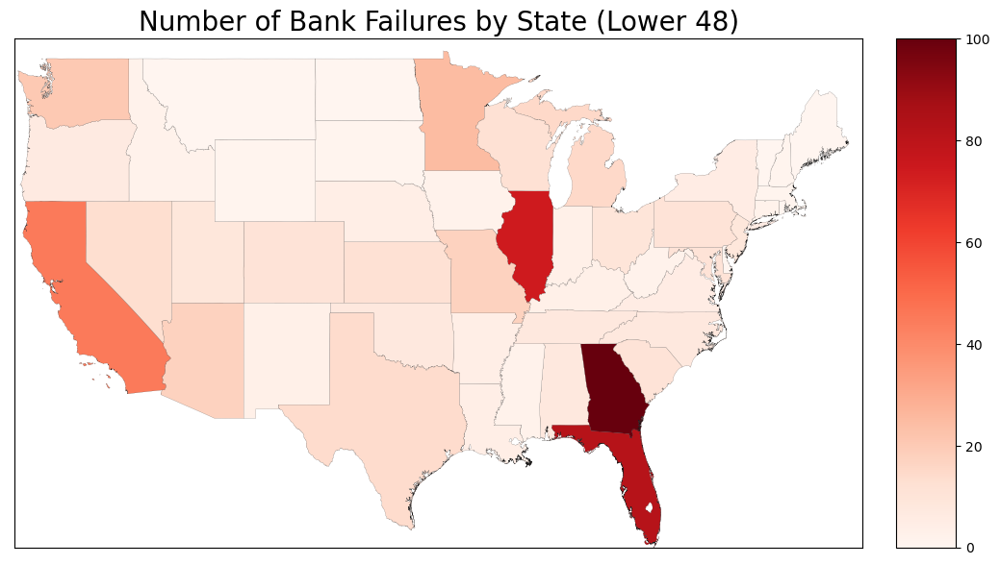
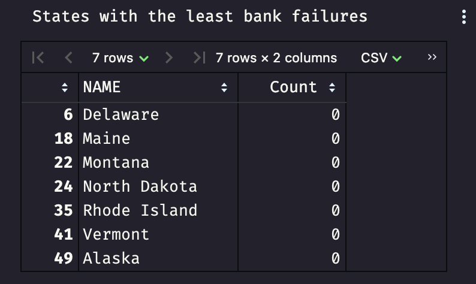
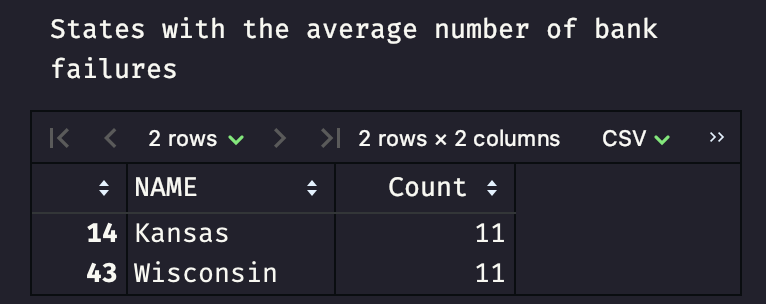

# Bank Failures By State

After the failure of Silicon Valley Bank in 2023 I got curious on what states have had bank failures and if they are more common in some and less in others.
This repo contains the data and code to generate what I found. According to the FDIC's website, the data in this repo only goes back to October 1, 2000.

banklist.csv source - [FDIC website](https://www.fdic.gov/resources/resolutions/bank-failures/failed-bank-list/)  
United States shapefile source - [National Weather Service](https://www.weather.gov/gis/USStates)

I also have a visual of all 50 US states, but Alaska has 0 failures and Hawaii has 1, so it's not very interesting. See it [here](all50.png).